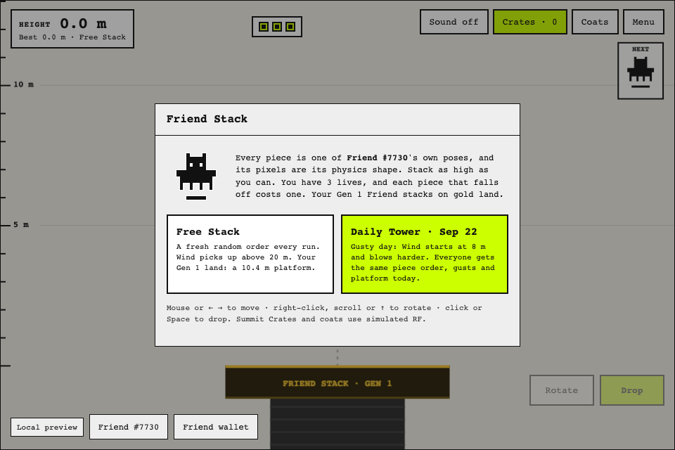
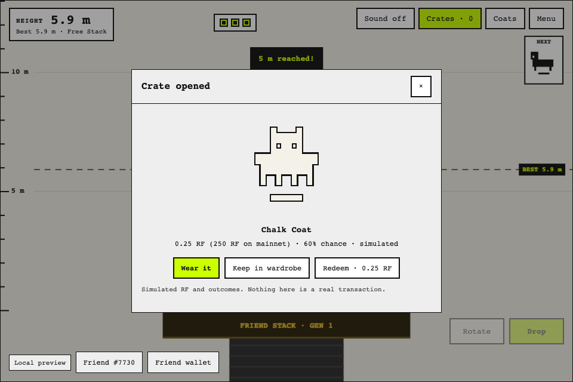
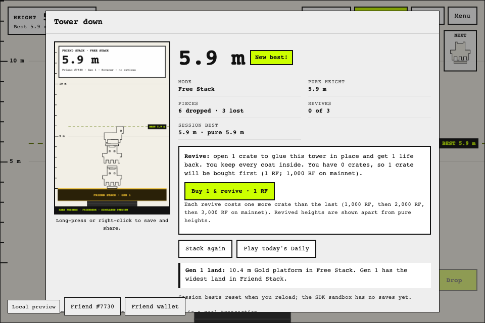
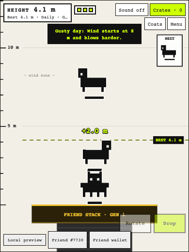

**Project name**
Friend Stack

**Builder / contact**
BitcoinLouie · [@Bitcoinlouie](https://github.com/Bitcoinlouie)

**Category**
Character Spotlight

**What did you build?**
A physics tower stacker where every piece is one of your own Rare Friend's on-chain poses, and each pose's 16 × 16 pixel mask is its exact collision shape. Spiky Friends interlock, round ones roll and hollow ones catch other pieces, so every NFT plays differently.

**How does it use Rare Friends?**
Connect your wallet and choose your hardwired Generations Friend. The game reads that Friend's canonical sprite frames through FriendSDK and turns every distinct pose into a rigid body. It also reads the Friend's generation: in Free Stack, higher generations get more "land" (a wider platform, following the docs' "promotion gives your Rare Friend more land"), and the platform's material shows the generation, from Stone at Gen 6 to Gold at Gen 1.

**Source code**
[GitHub repository](https://github.com/Bitcoinlouie/friend-stack/tree/a0c1f65ddd352450951b51a60e565b47a49f15c7/games/friend-stack) · FriendSDK v0.1.2, with [planck.js](https://github.com/piqnt/planck.js) (Box2D) for physics. The repository is a fork of FriendSDK; the game is in `games/friend-stack`.

**Playable demo / how to run**
Public preview: **https://bitcoinlouie.github.io/friend-stack/**

You need a browser wallet on Robinhood mainnet (chain 4663) holding a hardwired Generations NFT (generation 1 or higher). On a phone, open the link in your wallet app's built-in browser. No RF funding or transaction signature is needed; all balances and outcomes are simulated.

To run locally with Node.js 22+:

```sh
git clone https://github.com/Bitcoinlouie/friend-stack.git
cd friend-stack
git checkout a0c1f65ddd352450951b51a60e565b47a49f15c7
npm ci
(cd games/friend-stack && npm ci)
npm run dev:game -- games/friend-stack
```

Open `http://localhost:4173`.

**How do you play?**
Aim, rotate and drop your Friend's poses onto the platform and stack as high as you can. You have 3 lives; each piece that falls off costs one.

- **Keyboard:** ← → or A D to move, ↑ W X to rotate, Space or ↓ to drop.
- **Mouse:** move to aim, right-click or scroll to rotate, click to drop.
- **Touch:** drag to move, tap to rotate, swipe down or press **Drop**.

Modes:
- **Free Stack:** a random pose order, and the platform width depends on your Friend's generation.
- **Daily Tower:** seeded by the UTC date, so everyone gets the same pose order, wind gusts, standard platform and a daily modifier (Calm, Gusty, Icy, Moon or Narrow).

Above the wind zone, gusts are announced about a second early, and the drop guide bends to show the drift. The game-over screen makes a shareable tower card. Sound (off by default), reduced motion, loading and error states, and pause during menus are all supported.

**Costs and rewards**
Everything is simulated and labelled in game. The SDK preview wallet holds a fixed 20 RF, so preview prices run at 1:1000 of the planned mainnet prices. The game shows both.

| | Preview (`game.json`) | Planned mainnet |
| --- | --- | --- |
| Summit Crate | 1 RF | 1,000 RF |
| Chalk Coat · 60% | 0.25 RF | 250 RF |
| Brick Coat · 25% | 1 RF | 1,000 RF |
| Neon Coat · 12% | 2 RF | 2,000 RF |
| Summit Crown · 3% | 8 RF | 8,000 RF |
| Expected reward per crate | 0.88 RF | 880 RF |
| Revives (1st / 2nd / 3rd) | 1 / 2 / 3 crates | 1,000 / 2,000 / 3,000 RF |

- **Carry a crate up:** once the tower reaches 3 m, a crate parachutes down in place of your next piece. If it touches your tower above 1.5 m, it sticks and opens through the SDK's `play` and `settle` actions. If it misses, it returns to your pack unopened.
- **Revive:** when your last life goes, open 1, then 2, then 3 crates to glue the standing tower in place and get 1 life back, up to 3 times per tower. You keep every coat inside. Revived heights are shown separately from pure heights.
- **Coats:** each crate reveals a coat that restyles every piece. Keep it, or redeem it for its fixed RF value with no expiry. Holding a Chalk, Brick and Neon Coat at once unlocks the cosmetic Prism Coat, which has no RF value.
- **Where the RF goes:** under the SDK v0.1.2 `ChanceGame` contract, crate payments fund the game's prize pool, and the 12% edge stays with the developer who funds the prizes. Crate spending burns no RF. The game's protocol link is generation-based land: a wider Free Stack platform per generation, with nudges that show each promotion's real protocol price (for example 9,000 RF for Gen 3 → Gen 2, half burned and half to active NFT rewards).

A Session spend panel in the Crates menu shows RF spent, crates opened, coat value received and the prize pool's result at mainnet scale. [Full rules, odds and economy notes](https://github.com/Bitcoinlouie/friend-stack/blob/a0c1f65ddd352450951b51a60e565b47a49f15c7/games/friend-stack/README.md#the-rarefriends-loop-simulated).

**What have you tested?**
- `npx friendsdk check games/friend-stack` and the game's TypeScript typecheck pass.
- An automated browser check (`node games/friend-stack/test.mjs`) runs the real runtime and sandbox with the SDK's test wallet and sample Friend at 960 px and at 390 px portrait. It covers: choosing a mode; generation land (the fixture Friend is Gen 1); buying, carrying and opening a crate through the runtime confirmation; wearing a coat; losing all lives; the tower card; a paid revive with both confirmations; the Session spend panel; and the Daily Tower's standard platform.
- Headless physics simulations were used to tune sticky crates (37 of 38 aimed crates open) and wind strength.
- Played with a real wallet and an owned Friend in a desktop browser, both locally and on the public GitHub Pages preview.

**Known limitations**
- Progress, session bests, the worn coat and Daily results reset on reload, because the SDK sandbox has no save API. A real Daily leaderboard would need persistence and a backend.
- Tier-based perks are not implemented, because the SDK exposes no tier read.
- Browser checks use the SDK's test wallet and simulated RPC responses. Gens 2 to 6 were not browser-tested (the fixture Friend is Gen 1); their land and promotion values were checked directly.
- No live token spending, trading, wearable NFTs or creator fees.

**Credits**
- Friend artwork: canonical Rare Friends Generations sprites via FriendSDK ([NOTICE](https://github.com/Bitcoinlouie/friend-stack/blob/a0c1f65ddd352450951b51a60e565b47a49f15c7/NOTICE.md)).
- Sounds: FriendSDK sound kit, plus landing thuds synthesised in code.
- Physics: [planck.js](https://github.com/piqnt/planck.js) (MIT).
- Everything else (platform, crate, parachute, crown, coats, sky, tower card) is drawn in code for this game. Screenshots below were captured with the SDK test harness's sample Friend #7730.





